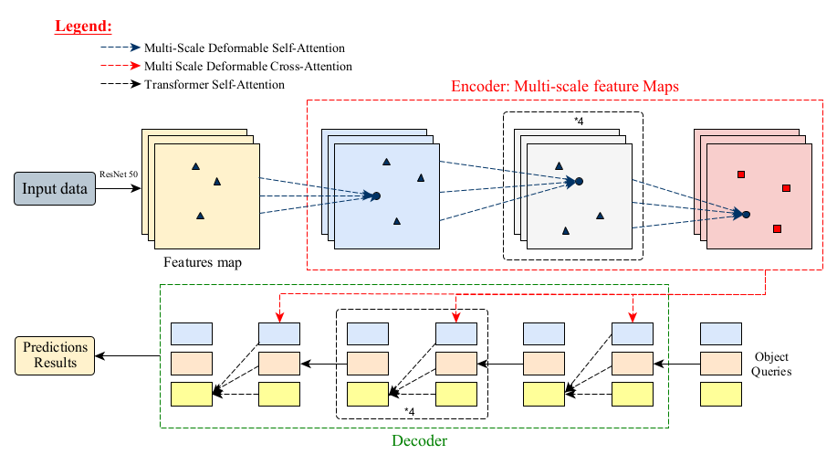

# 🛰 Deformable Attention Mechanisms Applied to Remotely Sensed Images

This repository contains the data and resources needed to apply **Deformable DETR** (Zhu et al., 2021) to optical and SAR remote‑sensing imagery and to benchmark it against a wide range of modern detectors.

    

## 📊 Notebooks for Benchmarking

For each dataset (**Pleiades Aircraft** and **SSDD Ship Detection**), we provide Google Colab notebooks that fine‑tune and evaluate the following detectors:

- **DN-DETR** – *DETR with DeNoising anchors for faster convergence* (Li et al., 2022)
- **Conditional DETR** – *Conditional cross‑attention queries* (Meng et al., 2021)
- **DAB-DETR** – *Dynamic Anchor Boxes* (Liu et al., 2022)
- **Deformable DETR** – *Multi‑scale deformable attention* (Zhu et al., 2021)
- **DETR** – *Baseline transformer detector* (Carion et al., 2020)
- **YOLO V10** – *One‑stage CNN detector* (Redmon et al., 2016)
- **RetinaNet** – *Focal‑loss one‑stage detector* (Lin et al., 2017)
- **Faster R‑CNN** – *Two‑stage region‑proposal detector* (Ren et al., 2015)

Each model comes with two notebooks:
1. **Training / Validation / Testing** – full end‑to‑end pipeline.
2. **Quick Inference** – load a fine‑tuned checkpoint and run predictions on a folder of images.

---
## 📁 Repository Structure

The proposed notebooks are organised as pairs: a *full pipeline* notebook and a *quick inference* notebook for every detector listed above — 20 notebooks in total.

You can download the corresponding fine‑tuned checkpoints under **[Fine‑Tuned Models](https://drive.google.com/drive/u/1/folders/1xf-vNriat8YUJQGu-fedciORcqXCzzW6?usp=sharing)**. *NB:* unzip the DETR and Deformable DETR weights before using them in the inference notebooks (folder: `Predictions`).

---
## 🗺️ Data to Be Used

This Google Drive folder **[Datasets](https://drive.google.com/drive/folders/1-8UDTKH-A7PerjXUXKDAXtTWKYRdj7IS?usp=sharing)** hosts the two datasets (optical and SAR) employed for training, validation and testing.

---
## 📈 Workflow Diagram of Deformable DETR

The diagram below summarises the architecture of **Deformable DETR**. It highlights the CNN backbone, the multi‑scale deformable‑attention modules and the Transformer decoder that predicts object classes and bounding boxes.

    

---
## ▶️ Execution Instructions

Open any notebook in **Google Colab**, switch the runtime to *GPU*, and — for best performance — choose an **NVIDIA A100** if available.

---
## 🧪 Testing Phase

The testing stage includes:
1. Visualising predictions.
2. Computing the following metrics:
   - **Precision**
   - **Recall**
   - **F1‑Score**
   - **mAP@50**
   - **mAP@75**
   - **mAP@[0.5:0.95]**

---
## 🏆 Metric Results for 12 Epochs (%)

Performance of **Deformable DETR** after 12 epochs on both datasets.

### Pleiades Aircraft Dataset

| Model                 | Training Time (s) | Precision | Recall | F1‑Score | mAP@50 | mAP@75 | mAP@[0.5:0.95] |
|-----------------------|-------------------|-----------|--------|----------|--------|--------|----------------|
| **RetinaNet**         | 719.46            | 80.80     | 73.30  | 76.87    | 74.76  | 69.56  | 55.80          |
| **Faster R-CNN**      | 435.22            | 93.33     | 93.33  | 93.33    | 81.66  | 78.97  | 73.77          |
| **YOLO V10**          | 365.32            | 96.34     | 91.43  | 93.82    | 97.34  | 76.00  | 65.36          |
| **DETR**              | 327.34            | 93.21     | 90.35  | 91.19    | 80.05  | 78.46  | 73.44          |
| **DN-DETR**           | 354.15            | 92.54     | 87.60  | 89.90    | 83.16  | 80.14  | 73.81          |
| **Conditional DETR**  | 338.93            | 94.01     | 88.48  | 91.10    | 83.84  | 82.26  | 73.98          |
| **DAB-DETR**          | 329.36            | 95.23     | 90.06  | 92.57    | 95.14  | 87.53  | 74.19          |
| **Deformable DETR**   | **306.53**        | **97.76** | **92.62** | **95.12** | **98.42** | **89.42** | **76.75** |

---

### SSDD SAR Dataset

| Model                 | Training Time (s) | Precision | Recall | F1‑Score | mAP@50 | mAP@75 | mAP@[0.5:0.95] |
|-----------------------|-------------------|-----------|--------|----------|--------|--------|----------------|
| **RetinaNet**         | 3997.13           | 83.85     | 83.13  | 82.80    | 86.75  | 78.02  | 64.54          |
| **Faster R-CNN**      | 3452.22           | 90.36     | 87.23  | 88.77    | 91.61  | 73.93  | 62.53          |
| **YOLO V10**          | 3750.52           | 94.05     | 90.31  | 92.14    | 96.49  | 81.49  | 75.44          |
| **DETR**              | 3583.12           | 86.31     | 89.21  | 87.74    | 95.42  | 84.12  | 73.86          |
| **DN-DETR**           | 3834.89           | 90.54     | 91.36  | 90.95    | 92.18  | 84.14  | 73.18          |
| **Conditional DETR**  | 3576.29           | 94.01     | 89.19  | 91.54    | 94.63  | 86.78  | 74.89          |
| **DAB-DETR**          | 3489.27           | 95.23     | 92.49  | 93.84    | 96.14  | 87.89  | 74.54          |
| **Deformable DETR**   | **3370.16**       | **96.26** | **92.88** | **94.54** | **97.31** | **88.66** | **76.14** |
