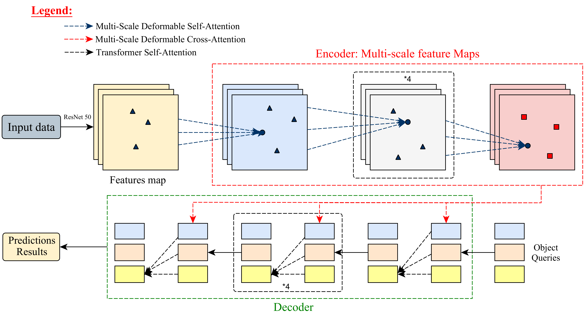

# 🛰 Deformable Attention Mechanisms Applied to Remotely Sensed Images

This repository contains the data and resources needed to apply **Deformable DETR** (Zhu et al., 2021) to optical and SAR remote‑sensing imagery and to benchmark it against a wide range of modern detectors.

    

## 📊 Notebooks for Benchmarking

For each dataset (**Pleiades Aircraft** and **SSDD Ship Detection**), we provide Google Colab notebooks that fine‑tune and evaluate the following detectors:

- **DN-DETR** ([Li et al., 2022](https://arxiv.org/abs/2203.01305))
- **Conditional DETR** ([Meng et al., 2021](https://openaccess.thecvf.com/content/ICCV2021/html/Meng_Conditional_DETR_for_Fast_Training_Convergence_ICCV_2021_paper.html))
- **DAB-DETR** ([Liu et al., 2022](https://arxiv.org/abs/2201.12329))
- **Deformable DETR** ([Zhu et al., 2021](https://arxiv.org/abs/2010.04159))
- **DETR** ([Carion et al., 2020](https://link.springer.com/chapter/10.1007/978-3-030-58452-8_13))
- **YOLO V11** ([Khanam et al., 2024](https://arxiv.org/abs/2410.17725))
- **RetinaNet** ([Lin et al., 2017](https://openaccess.thecvf.com/content_iccv_2017/html/Lin_Focal_Loss_for_ICCV_2017_paper.html))
- **Faster R-CNN** ([Ren et al., 2015](https://arxiv.org/abs/1506.01497))

Each model comes with two notebooks:
1. **Training / Validation / Testing** – full end‑to‑end pipeline.
2. **Quick Inference** – load a fine‑tuned checkpoint and run predictions on a folder of images.

---
## 📁 Repository Structure

The proposed notebooks are organised as pairs: a *full pipeline* notebook and a *quick inference* notebook for every detector listed above — 20 notebooks in total.

You can download the corresponding fine‑tuned checkpoints under **[Fine‑Tuned Models](https://drive.google.com/drive/u/1/folders/1xf-vNriat8YUJQGu-fedciORcqXCzzW6?usp=sharing)**. *NB:* unzip the DETR and Deformable DETR weights before using them in the inference notebooks (folder: `Predictions`).

---
## 🗺️ Data to Be Used

This Google Drive folder **[Datasets](https://drive.google.com/drive/folders/1-8UDTKH-A7PerjXUXKDAXtTWKYRdj7IS?usp=sharing)** hosts the two datasets (optical and SAR) employed for training, validation and testing.

---
## 📈 Workflow Diagram of Deformable DETR

The diagram below summarises the architecture of **Deformable DETR**. It highlights the CNN backbone, the multi‑scale deformable‑attention modules and the Transformer decoder that predicts object classes and bounding boxes.

    

---
## ▶️ Execution Instructions

Open any notebook in **Google Colab**, switch the runtime to *GPU*, and — for best performance — choose an **NVIDIA A100** if available.

---
## 🧪 Testing Phase

The testing stage includes:
1. Visualising predictions.
2. Computing the following metrics:
   - **Precision**
   - **Recall**
   - **F1‑Score**
   - **mAP@50**
   - **mAP@75**
   - **mAP@[0.5:0.95]**

---
## 🏆 Metric Results for 12 Epochs (%)

Performance of **Deformable DETR** after 12 epochs on both datasets.

#### Pleiades Aircraft – Test Results

| Metric             | RetinaNet | Faster R-CNN | YOLOv11 | DETR   | DN-DETR | Conditional DETR | DAB-DETR | **Deformable DETR** |
|--------------------|-----------|--------------|---------|--------|---------|-------------------|----------|----------------------|
| Training Time (s)  | 719.46    | 435.22       | 342.39  | 327.34 | 354.15  | 338.93            | 329.36   | **306.53**           |
| Precision (%)      | 80.80     | 93.33        | 96.01   | 93.21  | 92.54   | 94.01             | 95.23    | **97.76**            |
| Recall (%)         | 73.30     | 93.33        | 92.55   | 90.35  | 87.60   | 88.48             | 90.06    | **92.62**            |
| F1-Score (%)       | 76.87     | 93.33        | 94.27   | 91.19  | 89.90   | 91.10             | 92.57    | **95.12**            |
| mAP@50 (%)         | 74.76     | 81.66        | 98.16   | 80.05  | 83.16   | 83.84             | 95.14    | **98.42**            |
| mAP@75 (%)         | 69.56     | 78.97        | 76.33   | 78.46  | 80.14   | 82.26             | 87.53    | **89.42**            |
| mAP (%)            | 55.80     | 73.77        | 66.18   | 73.44  | 73.81   | 73.98             | 74.19    | **76.75**            |

---

#### SSDD SAR – Test Results

| Metric             | RetinaNet | Faster R-CNN | YOLOv11 | DETR   | DN-DETR | Conditional DETR | DAB-DETR | **Deformable DETR** |
|--------------------|-----------|--------------|---------|--------|---------|-------------------|----------|----------------------|
| Training Time (s)  | 3997.13   | 3452.22      | 3401.79 | 3583.12| 3834.89 | 3576.29           | 3489.27  | **3370.16**          |
| Precision (%)      | 83.85     | 90.36        | 94.29   | 86.31  | 90.54   | 94.01             | 95.23    | **96.26**            |
| Recall (%)         | 83.13     | 87.23        | 92.14   | 89.21  | 91.36   | 89.19             | 92.49    | **92.88**            |
| F1-Score (%)       | 82.80     | 88.77        | 93.18   | 87.74  | 90.95   | 91.54             | 93.84    | **94.54**            |
| mAP@50 (%)         | 86.75     | 91.61        | 96.81   | 95.42  | 92.18   | 94.63             | 96.14    | **97.31**            |
| mAP@75 (%)         | 78.02     | 73.93        | 83.25   | 84.12  | 84.14   | 86.78             | 87.89    | **88.66**            |
| mAP (%)            | 64.54     | 62.53        | 76.03   | 73.86  | 73.18   | 74.89             | 74.54    | **76.14**            |

